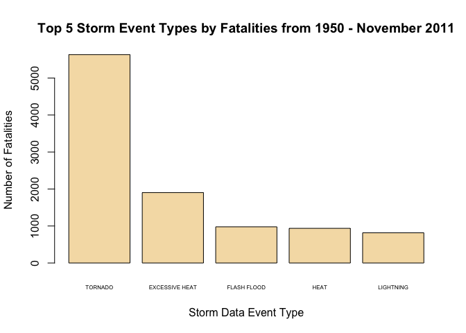
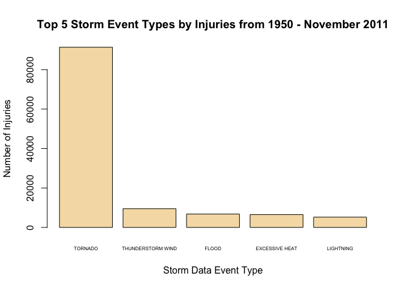
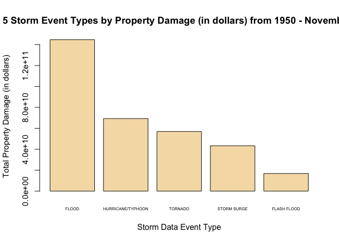

# Analyisis to determine economic impact of severe weather events using NOAA storm data
Telvis Calhoun  
December 26, 2015  

## Introduction

Title: Analyisis to determine economic impact of severe weather events using NOAA storm data

Synopsis: In this document, we analyze the U.S. National Oceanic and Atmospheric Administration's (NOAA) storm database to determine the economic impact of different weather events. The goal of the analysis is to rank the storm events based on (1) public health impact and (2) economic impact. Our hope is that this ranking will inform policy makers as they allocate emergency management funds to the events with the greatest economic impact.  

## Data Processing
We must first pre-process data prior to performing the analysis. This section shows the data transformation steps performed on the raw NOAA storm data.

First, lets load libraries used in the analysis


```r
library(lubridate)
library(dplyr)
```

Now we will fetch the data and load CSV file. The file in bzip'd so we'll use bzfile()

```r
if(!file.exists("repdata-data-StormData.csv.bz2")){
  download.file("https://d396qusza40orc.cloudfront.net/repdata%2Fdata%2FStormData.csv.bz2", 
              "repdata-data-StormData.csv.bz2", method = "curl")
}
df <- read.csv(bzfile("repdata-data-StormData.csv.bz2"), na.strings="", stringsAsFactors = FALSE)
```

### EVTYPE Cleanup
The values in the `EVTYPE` column are not consistent for the same event type. One example is "THUNDERSTORM WIND". It appears in the data as variations of "TSTM WIND", "THUNDERSTORM WINDS" and many other values that include arbitrary prefixes and suffixes. Let's attempt to normalize those variations.


```r
  # fix thunderstorm wind labels. Being careful not to change 'MARINE THUNDERSTORM WIND'.
  df <- mutate(df, 
               EVTYPE=ifelse(grepl("^(?!MARINE)?\\s*TSTM", EVTYPE, perl=TRUE), 
                             "THUNDERSTORM WIND", 
                             EVTYPE))
  df <- mutate(df, 
               EVTYPE=ifelse(grepl("^(?!MARINE)?\\s*THUNDERSTORM", EVTYPE, perl=TRUE), 
                             "THUNDERSTORM WIND", 
                             EVTYPE))
  
  # fix marine thunderstorm winds
  df <- mutate(df, EVTYPE=ifelse(grepl("MARINE\\s*TSTM", EVTYPE, perl=TRUE), 
                                 "MARINE THUNDERSTORM WIND", 
                                 EVTYPE))
  df <- mutate(df, EVTYPE=ifelse(grepl("MARINE\\s*THUNDERSTORM", EVTYPE, perl=TRUE), 
                                 "MARINE THUNDERSTORM WIND", 
                                 EVTYPE))
```

NOTE: There are probably other event types that coud be cleaned up. "THUNDERSTORM WIND" was the only value that impacted our rank analysis.

Finally, let's convert `EVTYPE` to a factor variable. This is useful for when we use `dplyr::group_by`.


```r
df <- transform(df, EVTYPE=factor(EVTYPE))
```

### PROPDMGEXP Cleanup

The `PROPDMGEXP` column defines the power of 10 to multiply by `PROPDMG` to calculate the Property Damage in Dollars. Unfornately, the values in this column are string integers (e.g. "1", "2") or humanized abbreviations (e.g. K = thousands of dollars) or strange values like `+` and `?`. Let's clean this up.


```r
# Show the values in the RAW data. 
table(df$PROPDMGEXP)
```

```
## 
##      -      ?      +      0      1      2      3      4      5      6 
##      1      8      5    216     25     13      4      4     28      4 
##      7      8      B      h      H      K      m      M 
##      5      1     40      1      6 424665      7  11330
```

```r
# function to perform the tranformation from the various input values
map_propdmgexp <- function(x){
  x <- x[[1]]
  
  if (is.na(x)){
    ret = NA
  } else if ( x %in% c("-","?","+")){
    ret = NA 
  } else if (toupper(x) %in% c("B", "K", "M", "H")){
    exp_mappings <- c("B"=9, "H"=2, "K"=3, "M"=6)
    ret = exp_mappings[toupper(x)]
  } else {
    # assume its a number string
    ret = as.numeric(x)
    if (is.na(ret)){
      stop(sprintf("Unexpected 'NA' %s", x))
    }
  }
  ret
}

# use mapply and map_propdmgexp() to convert 'exp' values
df$PROPDMGEXP_mapped <- mapply(map_propdmgexp, df$PROPDMGEXP)

# check the values now. should all be integer strings
table(df$PROPDMGEXP_mapped)
```

```
## 
##      0      1      2      3      4      5      6      7      8      9 
##    216     25     20 424669      4     28  11341      5      1     40
```

Now lets calculate the property damage in `TOTALCOST`

```r
df$TOTALCOST <- df$PROPDMG * 10 ** df$PROPDMGEXP_mapped
```

Finally, let's aggregate our transformed data by `EVTYPE` since all of our results are based on aggreagate of `EVTYPE`


```r
by_evtype <- group_by(df, EVTYPE)
```

## Results

### Across the United States, which types of events are most harmful with respect to population health? 

`TORNADO` events have the greatest public health impact if we rank based on `Fatalities`. The next greatest event type is `EXCESSIVE HEAT` - which has resulted in 2000 deaths since 1950.


```r
fatalities_by_evtype <- summarize(by_evtype, FATALITIES=sum(FATALITIES, na.rm=TRUE)) %>% 
                        arrange(desc(FATALITIES))
top_fatalities_by_evtype = head(fatalities_by_evtype, n=5)

# plot
barplot(height=top_fatalities_by_evtype$FATALITIES, 
          names.arg = top_fatalities_by_evtype$EVTYPE, 
          cex.names=0.50, 
          col = "wheat",
          ylab = "Number of Fatalities", 
          xlab = "Storm Data Event Type", 
          main="Top 5 Storm Event Types by Fatalities from 1950 - November 2011")
```

 


`TORNADO` events have the greatest public health impact if we rank based on `Injuries`. The next greatest event type is `THUNDERSTORM WIND`.


```r
injuries_by_evtype <- summarize(by_evtype, INJURIES=sum(INJURIES, na.rm=TRUE)) %>% 
                      arrange(desc(INJURIES))
top_injuries_by_evtype = head(injuries_by_evtype, n=5)

#plot
barplot(height=top_injuries_by_evtype$INJURIES, 
        names.arg=top_injuries_by_evtype$EVTYPE, 
        cex.names = 0.50, 
        col = "wheat",
        ylab = "Number of Injuries", 
        xlab = "Storm Data Event Type", 
        main="Top 5 Storm Event Types by Injuries from 1950 - November 2011")
```

 


### Across the United States, which types of events have the greatest economic consequences?

`FLOOD` events have the greatest economic impact, followed by `HURRICANE/TYPHOON`. Also, notice that `TORNADO` is in the top 5 storm events based on ecomomic impact.


```r
prop_dmg_by_evtype <- summarize(by_evtype, TOTALCOST=sum(TOTALCOST, na.rm=TRUE)) %>% arrange(desc(TOTALCOST))
top_prop_dmg_by_evtype = head(prop_dmg_by_evtype, n=5)

# plot
barplot(height=top_prop_dmg_by_evtype$TOTALCOST, 
        names.arg = top_prop_dmg_by_evtype$EVTYPE, 
        cex.names=0.50,
        col = "wheat",
        ylab = "Total Property Damage (in dollars)", 
        xlab = "Storm Data Event Type", 
        main="Top 5 Storm Event Types by Property Damage (in dollars) from 1950 - November 2011")
```

 

## Conclusion

**Tornados** pose a significant public health risk in terms of injuries, fatalities and ecomomic cost. Additionally, **Excessive Heat** poses a public health risk based on fatalities. **Floods** pose the greatest risk in terms of economic cost.
